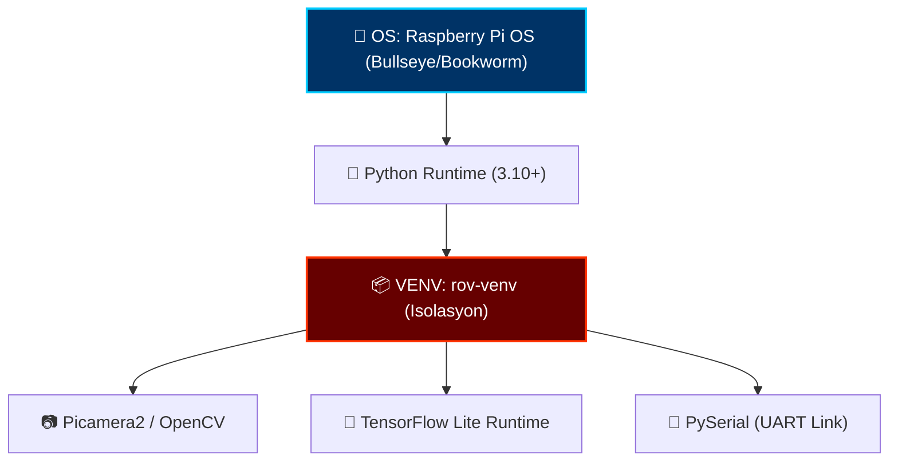

# 🛠️ STRATEJİK HAZIRLIK: SİSTEM KURULUMU

> [!NOTE]
> Bu modül, ROV platformunun yazılımsal temel taşıdır. Sistem stabilitesi için yönergelerin eksiksiz uygulanması kritiktir.

## 🛰️ Çevre Mimarisi

Aşağıdaki şema, yazılım katmanlarının izolasyonunu ve bağımlılık hiyerarşisini gösterir.



## 🛠️ Operasyonel Adımlar

### 1. Sistem Güncelleme ve Çekirdek Araçlar
```bash
sudo apt update && sudo apt upgrade -y
sudo apt install arduino python3-venv libatlas-base-dev -y
```

### 2. İzolasyon Protokolü (VENV)
```bash
cd ~/rov-project
python3 -m venv rov-venv
source rov-venv/bin/activate
pip install --upgrade pip setuptools wheel
pip install opencv-python numpy pyserial tflite-runtime
```

---

[⬅️ Komuta Merkezine Dön](file:///c:/github%20repolar%C4%B1m/rov/README.md)
