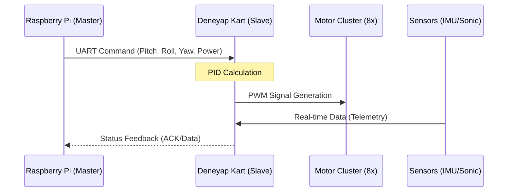

# 🔌 AKTÜATÖR VE SENSÖR KATMANI

> [!IMPORTANT]
> Gerçek zamanlı veri akışı ve motor stabilizasyonu için Deneyap Kart (ESP32) üzerinde çalışan 'firmware' katmanıdır.

## 🕹️ Donanım Kontrol Akışı

## 📂 Dosya Envanteri

- **[manuel_kontrol_8motor.ino](file:///c:/github%20repolar%C4%B1m/rov/01_Temel_Donanim_Kontrol/manuel_kontrol_8motor.ino):** Ana kontrol yazılımı.
- **[pid_dengeleme_imu.ino](file:///c:/github%20repolar%C4%B1m/rov/01_Temel_Donanim_Kontrol/pid_dengeleme_imu.ino):** IMU destekli otopilot dengeleme.
- **[haberlesme_deneyap_ultrasonik.ino](file:///c:/github%20repolar%C4%B1m/rov/01_Temel_Donanim_Kontrol/haberlesme_deneyap_ultrasonik.ino):** Engel algılama protokolü.

---

[⬅️ Komuta Merkezine Dön](file:///c:/github%20repolar%C4%B1m/rov/README.md)
