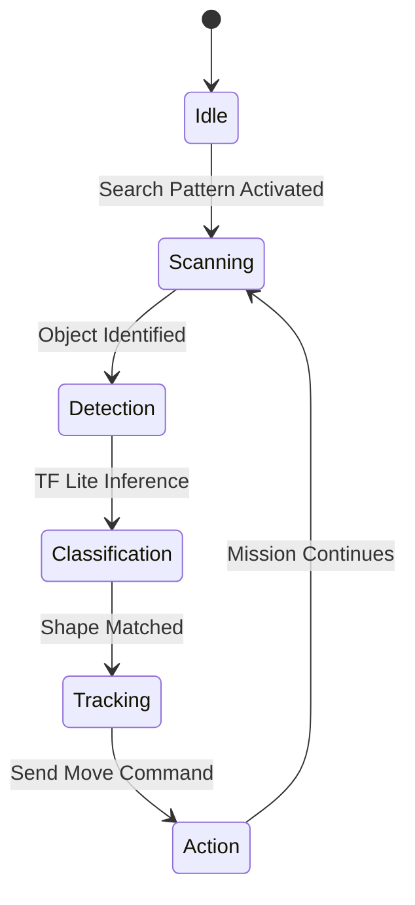

# 👁️ VİZYONER ZEKA: EDGE AI ENTEGRASYONU

> [!TIP]
> Görüntü işleme katmanı, sualtı görevlerinde otonom kararların alındığı 'Göz' birimidir.

## 🧠 Karar Verme Algoritması

## 📑 Öne Çıkan Protokoller

- **Paralel İşleme:** `paralel_sekil_cizgi_takip.py` ile gecikmesiz veri analizi.
- **TF Lite Modeli:** `shape_model_final1.h5` - Sualtı ışık koşullarına göre optimize edilmiş.
- **Hibrit Takip:** Hem çizgi (OpenCV) hem nesne (TensorFlow) eşzamanlı takibi.

---

[⬅️ Komuta Merkezine Dön](file:///c:/github%20repolar%C4%B1m/rov/README.md)
