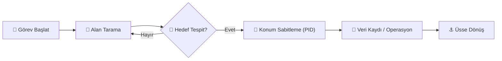

# 🎯 OTONOM GÖREV PROTOKOLLERİ

> [!WARNING]
> Bu modül, yüksek riskli operasyonel görevleri (Arama-Kurtarma, Tespit) icra eden algoritma setlerini barındırır.

## 🏆 Görev Akış Diyagramı

---

[⬅️ Komuta Merkezine Dön](file:///c:/github%20repolar%C4%B1m/rov/README.md)
