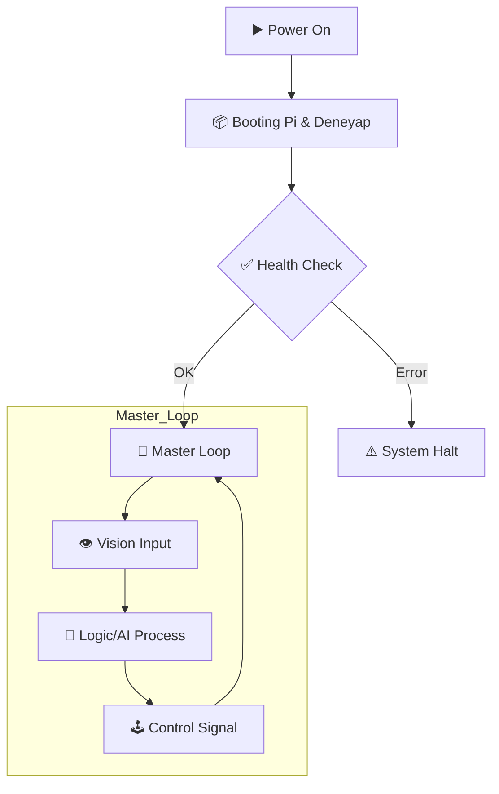

# ⚓ TOTAL ENTEGRASYON: FİNAL OPERASYONEL SÜRÜM

> [!CAUTION]
> **FİNAL SÜRÜM:** Bu dizindeki kodlar, tüm alt sistemlerin (Vision, Control, Telemetry) birleştiği en güncel 'Production' sürümleridir.

## 🚀 Operasyonel Master Loop

## ⚓ Kritik Dosyalar
- **[tensorlu_picamera_finish.py](file:///c:/github%20repolar%C4%B1m/rov/04_Final_Entegrasyon/tensorlu_picamera_finish.py):** Operasyonel ana kod.
- **[best_shape_model.keras](file:///c:/github%20repolar%C4%B1m/rov/04_Final_Entegrasyon/best_shape_model.keras):** En yüksek doğruluklu AI modeli.

---

[⬅️ Komuta Merkezine Dön](file:///c:/github%20repolar%C4%B1m/rov/README.md)
