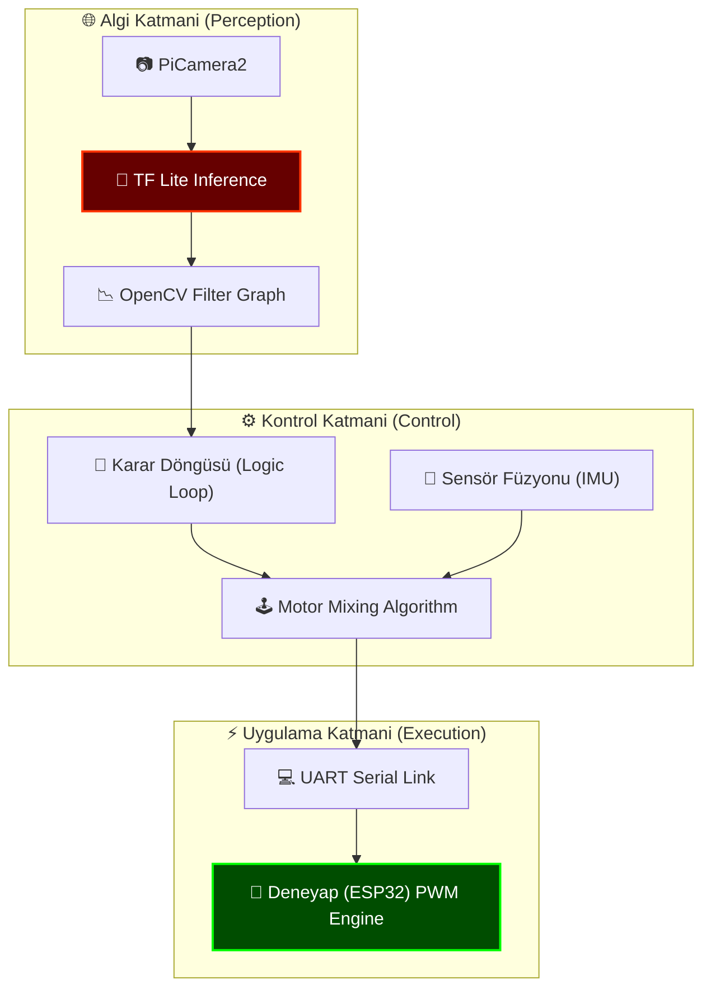

# 🏗️ SİSTEM MİMARİSİ: ENTEGRE BEYİN DOKTRİNİ

> [!NOTE]
> Bu doküman, Proje Neptune Alpha'nın teknik omurgasını ve katmanlı mimarisini açıklar.

## 🧠 Hiyerarşik Yapı

Sistem, üç ana katman üzerinden paralel olarak işlenir:

## 🔌 Donanım-Yazılım Sinerjisi

| Bileşen | Görev | Haberleşme Protokolü |
| :--- | :--- | :--- |
| **Raspberry Pi 4** | Yüksek Seviyeli Mantık & AI | Master |
| **Deneyap Kart** | Gerçek Zamanlı Motor Sürücü | Slave (UART) |
| **Picamera2** | Görsel Veri Toplama | CSI Bus |
| **BNO055 / IMU** | Oryantasyon & Stabilite | I2C |

## 🛡️ Otonom Karar Matrisi
Yazılım, otonom sürüş sırasında aşağıdaki öncelik sırasını takip eder:
1. **Safety First:** Engel algılandığında veya iletişim koptuğunda dur.
2. **Mission Critical:** Tanımlanan hedef (şekil) görüldüğünde takibe başla.
3. **Efficiency:** En kısa yoldan çizgi takibi veya navigasyon icra et.

---
*Mükemmel bir sistem, karmaşıklığı basitlikle yöneten sistemdir.*
