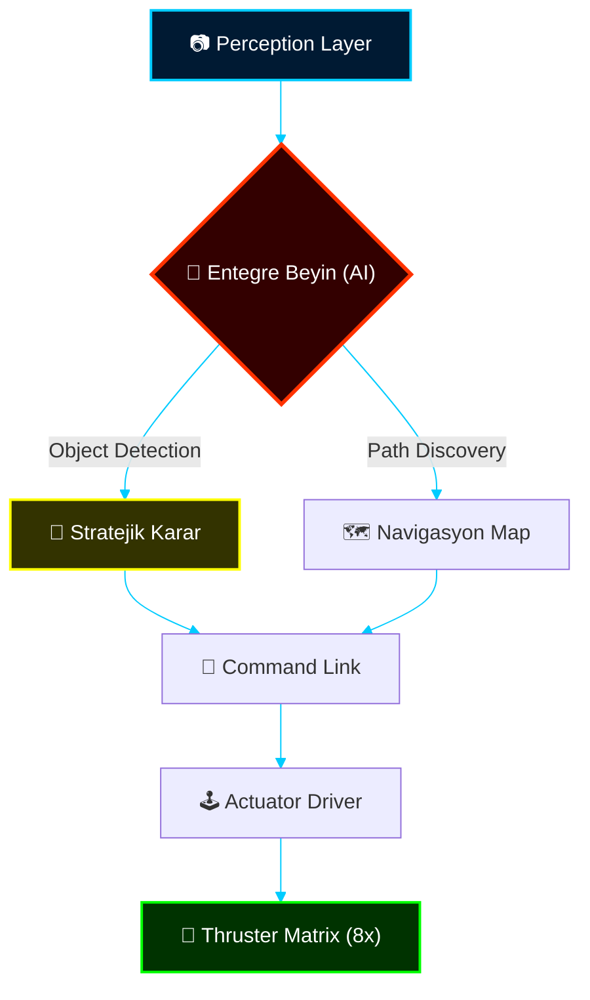

# 🔱 PROJECT NEPTUNE ALPHA: CYBERNETIC COMMAND CENTER

```text
[SYSTEM INITIALIZATION]
> Kernel Loading.......................... [OK]
> Neural Network Synchronization.......... [OK]
> Strategic Manifesto Loaded.............. [OK]
> Integrated Architecture Established..... [OK]
--------------------------------------------------
ID: NEPTUNE-ALPHA-PROJECT
STATUS: TRANSCENDENTAL - MISSION READY
```

---

## 🏗️ Stratejik Temeller (Visionary Foundation)

Bu platform, sadece bir eğitim reposu değil, sualtı otonom sistemler için bir **Teknoloji Doktrini**dir.

| 📜 [Manifesto](_MANIFESTO/STRATEGIC_VISION.md) | 🏗️ [Mimari](ARCHITECTURE.md) | ⚖️ [Etik](_MANIFESTO/ETHICS_PROTOCOLS.md) | 🗺️ [Harita](SUMMARY.md) |
| :---: | :---: | :---: | :---: |

---

## 🛰️ Sistem Mimarisi (Digital Control HUD)



---

## 🗺️ Operasyonel Doktrinler

### 🎓 [Eğitim Serisi (Modules)](SUMMARY.md#eğitim-modülleri)
Yazılımsal ve donanımsal temelleri kapsayan adım adım müfredat.

### 🛡️ [Mühendislik Protokollari (Advanced)](SUMMARY.md#teknik-protokoller)
*   🌡️ [Termal Stres Testi](PROTOCOLS/THERMAL_STRESS_TEST.md)
*   🧠 [Edge AI Optimizasyonu](PROTOCOLS/EDGE_AI_OPTIMIZATION.md)

---

## 📊 Teknolojik Ekosistem


---

> [!IMPORTANT]
> **PROJE NOTU:** Bu sistem, kısıtlı donanımları algoritmik derinlikle birleştirerek sualtı keşiflerinde yeni bir standart belirlemek üzere tasarlanmıştır.

---

[Geliştirici Dokümantasyonu](ARCHITECTURE.md) | [Sistem Logları](_ARCHIVE/) | [Sürüm: v3.0-Transcendental]
