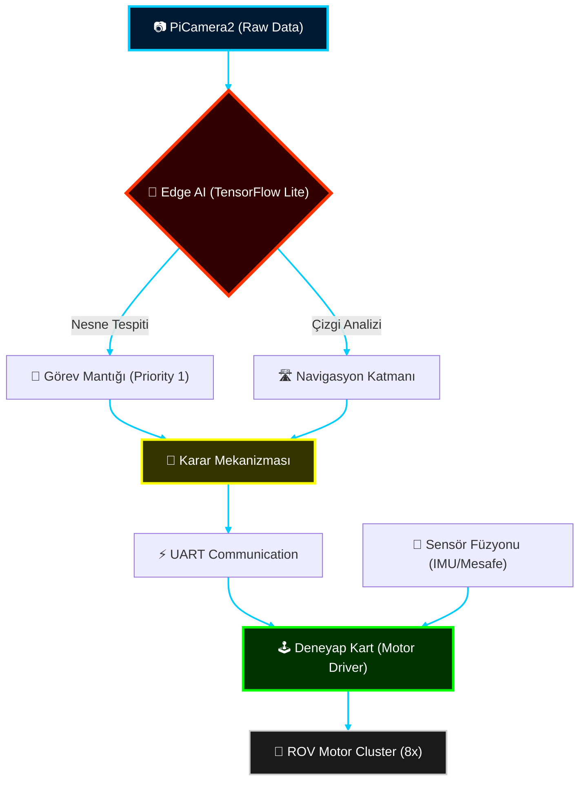

# 🌊 ROV TACTICAL COMMAND CENTER: ALPHA PROTOCOL

```text
[SYSTEM INITIALIZATION]
> Kernel Loading... OK
> Edge AI Models Synchronized... OK
> UART Link Established (Pi <-> Deneyap)... OK
> ROV Status: OPERATIONAL - READY FOR DEPLOYMENT
--------------------------------------------------
ID: ALPHA-01-ROV
CLASS: DEEP-SEA INTELLIGENCE PLATFORM
STATUS: TIER 1 - MISSION READY
```

---

## 🛰️ Sistem Mimarisi (Digital Command Panel)

Aşağıdaki HUD (Heads-Up Display) şeması, platformun otonom karar verme ve sensör füzyon mimarisini temsil eder.



---

## 🗺️ Operasyonel Doktrinler (Eğitim Serisi)

Bu platform, sadece bir robot değil, sualtında otonom varlık göstermeniz için bir **Mühendislik Kılavuzu**dur.

### 🛠️ [MODÜL 00: STRATEJİK HAZIRLIK](./00_Kurulum_ve_Hazirlik)
> *Sistem temelleri ve izolasyon protokolleri.*

### 🔌 [MODÜL 01: SENSÖR & AKTÜATÖR KATMANI](./01_Temel_Donanim_Kontrol)
> *Gerçek zamanlı düşük gecikmeli donanım kontrolü.*

### 👁️ [MODÜL 02: VİZYONER ZEKA](./02_Goruntu_Isleme_ve_AI)
> *Edge AI ve OpenCV ile sualtı algı sistemleri.*

### 🎯 [MODÜL 03: OTONOM GÖREV SETLERİ](./03_Gorev_Algoritmalari)
> *Arama-tarama ve otonom hedef imha algoritmaları.*

### ⚓ [MODÜL 04: TOTAL ENTEGRASYON](./04_Final_Entegrasyon)
> *Alpha sürüm: Tam otonom final kodları.*

---

## 🛡️ Teknik Spesifikasyonlar


| Özellik | Detay | Protokol |
| :--- | :--- | :--- |
| **Gecikme** | < 50ms (AI Inference) | TF-Lite |
| **Kontrol** | PID Loop (4-Axis) | Real-time |
| **Enerji** | Fail-Safe Protection | Active |
| **Görüş** | Night-Vision Logic | OpenCV |

---

> [!CAUTION]
> **OPR-STATUS:** Bu repo "Extreme" seviyede teknik içerik barındırır. Dokümantasyonu sırasıyla takip etmemek sistem instabilitesine yol açabilir.

---

[Elite Arşivi](./_ARCHIVE) | [Sistem Logları](./04_Final_Entegrasyon) | [Geliştirici: Bahattin Yunus]
