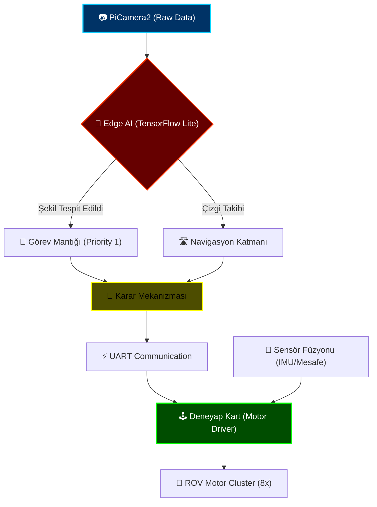

# 🌊 ROV TACTICAL COMMAND CENTER

> [!IMPORTANT]
> **Sistem Durumu:** ALPHA TEMSİLİYETİ - TÜM SİSTEMLER OPERASYONEL
> **Sınıflandırma:** Üst Düzey Sualtı Robotik ve Yapay Zeka Entegrasyon Platformu

---

## 🛰️ Sistem Mimarisi (Digital Command Panel)

Aşağıdaki şema, Raspberry Pi ve Deneyap Kart arasındaki stratejik veri akışını ve otonom karar verme mekanizmasını temsil eder.

---

## 🗺️ Operasyonel Modüller

Bu platform, sualtı görevlerini en zorlu koşullarda dahi başarıyla icra etmek üzere modüler bir doktrin üzerine inşa edilmiştir.

### 🛠️ [MODÜL 00: STRATEJİK HAZIRLIK](file:///c:/github%20repolar%C4%B1m/rov/00_Kurulum_ve_Hazirlik)
*Sistem kurulumu, çevre değişkenleri ve venv izolasyon protokolleri.*

### 🔌 [MODÜL 01: AKTÜATÖR VE SENSÖR KATMANI](file:///c:/github%20repolar%C4%B1m/rov/01_Temel_Donanim_Kontrol)
*Düşük gecikmeli motor kontrolü ve gerçek zamanlı telemetri verileri.*

### 👁️ [MODÜL 02: VIZYONER ZEKA (EDGE AI)](file:///c:/github%20repolar%C4%B1m/rov/02_Goruntu_Isleme_ve_AI)
*OpenCV ve TensorFlow ile sualtında yüksek başarımlı nesne tespiti.*

### 🎯 [MODÜL 03: OTONOM GÖREV PROTOKOLLERİ](file:///c:/github%20repolar%C4%B1m/rov/03_Gorev_Algoritmalari)
*Karmaşık senaryolar için otonom sürüş ve hedef odaklı algoritmalar.*

### ⚓ [MODÜL 04: TOTAL ENTEGRASYON](file:///c:/github%20repolar%C4%B1m/rov/04_Final_Entegrasyon)
*Tüm sistemlerin tek bir 'Master Loop' altında toplandığı final sürümü.*

---

## 🛡️ Teknik Protokoller ve Standartlar

| Protokol | Standart | Durum |
| :--- | :--- | :--- |
| **Görüntü İşleme** | OpenCV 4.x / TF Lite | Optimize Edildi |
| **Haberleşme** | UART / I2C | High-Speed |
| **Kontrol** | PID Stabilization | Aktif |
| **Dayanıklılık** | MIL-STD-810G (Teorik) | Planlanıyor |

---

> [!CAUTION]
> **Uyan:** Sualtı operasyonlarında sızdırmazlık testi yapılmadan donanım enerjilendirilmemelidir. 'Fail-Safe' kod bloklarının çalıştığından emin olun.

---

[Elite Geliştirici Kılavuzu](file:///c:/github%20repolar%C4%B1m/rov/_ARCHIVE) | [Hata Bildirimi](#) | [Sürüm: v2.0-Elite]
