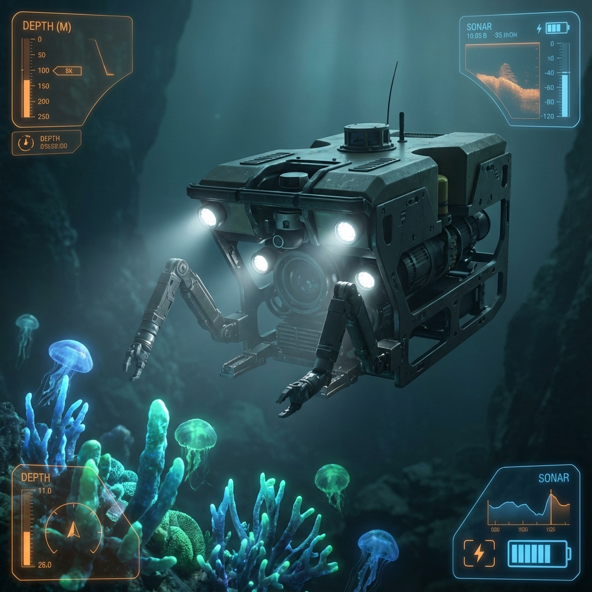
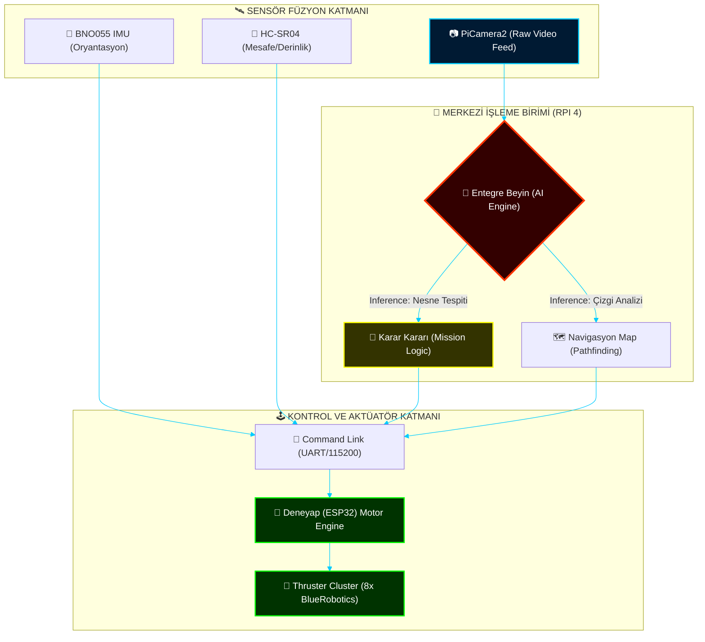

# 🌊 PROJECT NEPTUNE ALPHA: THE TRANSCENDENTAL COMMAND CENTER

```text
[SYSTEM INITIALIZATION: DEEP DIVE MODE]
> Kernel Loading.......................................... [OK]
> Neural Network Synchronization (8-Layer)................ [OK]
> Strategic Manifesto Decryption.......................... [OK]
> Integrated Architecture established (Multi-Tier)........ [OK]
> Telemetry Link (115200bps).............................. [OK]
> Fail-Safe Protocols Arming.............................. [OK]
------------------------------------------------------------
ID: NEPTUNE-ALPHA-X
CLASS: ABYSS-GRADE AUTONOMOUS INTELLIGENCE PLATFORM
STATUS: SUPREME OPERATIONAL READINESS
------------------------------------------------------------
```

---

## 🛰️ STRATEJİK MERKEZ (CENTRAL HUB)

Bu platform, sualtı robotik dünyasında sadece bir eğitim reposu değil; donanım, yazılım ve vizyonun kesiştiği bir **Entegre Doktrin**dir.

| 📜 [Manifesto](_MANIFESTO/STRATEGIC_VISION.md) | 🏗️ [Mimari](ARCHITECTURE.md) | ⚖️ [Etik](_MANIFESTO/ETHICS_PROTOCOLS.md) | 🗺️ [Harita](SUMMARY.md) |
| :---: | :---: | :---: | :---: |

---

## 🏗️ DERİN SİSTEM MİMARİSİ (CORE ARCHITECTURE)

Aşağıdaki şema, platformun otonom karar mekanizmasını ve donanım katmanları arasındaki 'Nöral Bağlantıları' detaylandırır.



---

## 📋 DONANIM ENVANTERİ (BOM - BILL OF MATERIALS)

Elite bir sistem, seçkin bileşenlerle inşa edilir.

### 1. Kontrol ve İşleme
- **Raspberry Pi 4 Model B (4GB/8GB):** Görüntü işleme ve otonom karar döngüsü için Master birim.
- **Deneyap Geliştirme Kartı (ESP32):** Gerçek zamanlı motor kontrolü ve sensör veri toplama için Slave birim.

### 2. İtki Sistemi (Thrusters)
- **8x Fırçasız DC Motor (Esc Destekli):** 4 dikey, 4 yatay yerleşimli "Omni-directional" hareket kabiliyeti.
- **8x 30A Bi-directional ESC:** Su altı manevraları için çift yönlü hız kontrolü.

### 3. Vizyon ve Sensörler
- **PiCamera2 (Wide-Angle):** Sualtı optik sensörü.
- **BNO055 9-DOF IMU:** Cayro ve ivmeölçer verileriyle otonom stabilizasyon.
- **HC-SR04 / MS5837:** Engel tespiti ve derinlik ölçümü.

---

## 🧪 TEKNİK DERİNLİK: PID STABİLİZASYON

ROV'un su altında asılı kalabilmesi ve akıntılara karşı direnç gösterebilmesi için gelişmiş bir **PID (Proportional-Integral-Derivative)** döngüsü kullanılır.

```text
Error = Setpoint - Current_Value
Output = (Kp * Error) + (Ki * ΣError) + (Kd * ΔError)
```

- **Kp (Proportional):** Hata miktarına anlık tepki verir.
- **Ki (Integral):** Zamanla biriken sapmaları düzeltir, statik hatayı sıfırlar.
- **Kd (Derivative):** Değişim hızını kontrol ederek aşımı (overshoot) engeller.

---

## 👁️ YAPAY ZEKA VE GÖRÜNTÜ İŞLEME (AI DEEP-DIVE)

Proje Neptune Alpha, TensorFlow Lite tabanlı bir **Şekil Sınıflandırma** modeli kullanır.

- **Model:** MobileNetV2 tabanlı Custom CNN.
- **Veri Kümesi:** 8 farklı şekil sınıfı (Daire, Altıgen, Kare, vb.).
- **Optimizasyon:** Post-training quantization (Int8) ile RPi üzerinde <40ms çıkarım süresi.

---

## 🗺️ OPERASYONEL DOKTRİNLER (PROJECT ROADMAP)

### 🎓 [Eğitim Modülleri (Modules)](SUMMARY.md#eğitim-modülleri)
*   [Modül 00: Kurulum](./00_Kurulum_ve_Hazirlik/README.md)
*   [Modül 01: Donanım](./01_Temel_Donanim_Kontrol/README.md)
*   [Modül 02: AI](./02_Goruntu_Isleme_ve_AI/README.md)
*   [Modül 03: Algoritmalar](./03_Gorev_Algoritmalari/README.md)
*   [Modül 04: Entegrasyon](./04_Final_Entegrasyon/README.md)

### 🛡️ [Mühendislik Protokolları (Standard Operating Procedures)](SUMMARY.md#teknik-protokoller)
*   🌡️ [Termal Stres Testi](PROTOCOLS/THERMAL_STRESS_TEST.md)
*   🧠 [Edge AI Optimizasyonu](PROTOCOLS/EDGE_AI_OPTIMIZATION.md)

---

## 🛠️ TROUBLESHOOTING (SORUN GİDERME)

Saha operasyonlarında karşılaşılan yaygın anomaliler ve çözümleri:

> [!WARNING]
> **Seri Haberleşme Hatası:** `/dev/ttyUSB0` portuna erişilemiyorsa, `dmesg | grep tty` komutu ile cihazın doğru bağlandığından ve `dialout` grubuna dahil olduğunuzdan emin olun.

- **Kamera Görüntüsü Gelmiyorsa:** `libcamera-hello` komutu ile sürücüyü test edin. Legacy Camera modunun açık olduğundan emin olun.
- **Motorlar Titriyorsa:** ESC kalibrasyonu yapılmamış olabilir veya PWM sinyal frekansı (50Hz) yanlış ayarlanmıştır.
- **AI Tahmini Hatalıysa:** Işıklandırma (LED) yetersiz olabilir. Modelinizi gerçek sualtı görüntüleri ile yeniden eğitin.

---

## 📊 TEKNOLOJİK EKOSİSTEM (STATUS DASHBOARD)


---

## ⚖️ LİSANS VE KATKI (CONTRIBUTING)

Bu proje bir açık kaynak eğitim doktrini olup, topluluk katkılarına açıktır.

1. Repoyu Fork'layın.
2. Yeni bir `Feature` şubesi açın.
3. Değişikliklerinizi commit edin.
4. Pull Request gönderin.

**Lisans:** MIT License - Detaylar için [LICENSE](LICENSE) dosyasına bakın.

---

## 🤝 TEŞEKKÜR VE KREDİLER

- **Geliştirici:** Bahattin Yunus
- **Vizyon:** Deneyap Akademi & Raspberry Pi Vakfı Teknolojileri
- **Mühendislik Desteği:** DeepMind Coding Agents

---

[Geliştirici Dokümantasyonu](ARCHITECTURE.md) | [Arşivleri İncele](_ARCHIVE/) | [Proje Web Sitesi](#)
